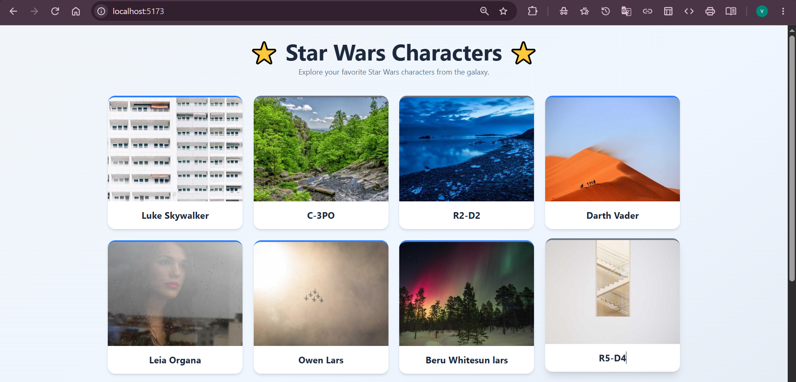
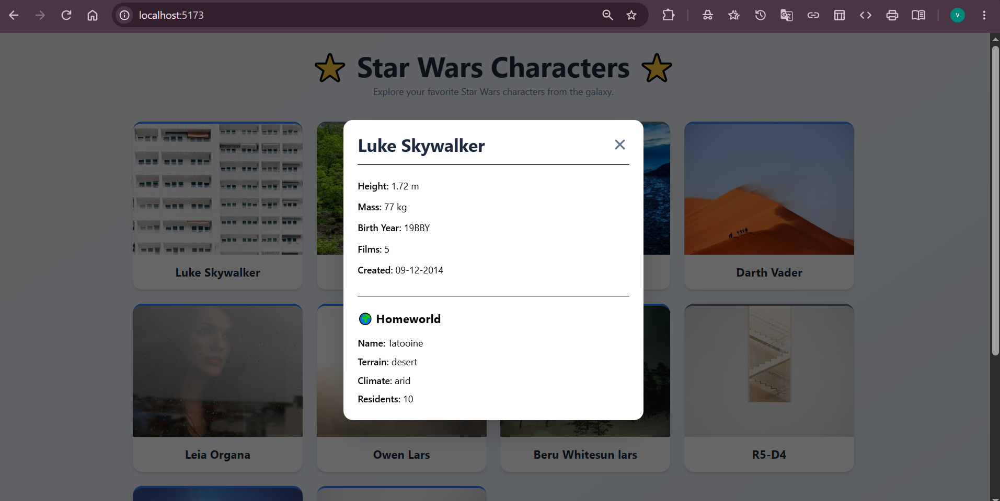
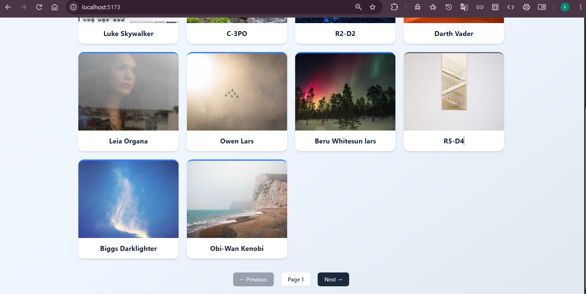

# Star Wars Character App

A responsive React + TypeScript application that displays Star Wars characters using SWAPI.

## Tech Stack

- React
- TypeScript
- Vite
- Tailwind CSS
- Axios

## Features

- Character List
- Pagination
- Character Details Modal
- Homeworld Information
- Species-based Card Color
- Responsive UI

## Run Locally

```bash
npm install
npm run dev
```

## Build

```bash
npm run build
```

## Links

- Live Demo: https://tsx-mern-06-aug2026-gamma.vercel.app/
- GitHub: https://github.com/vinita1512/tsx-mern-06Aug2026.git

## Screenshots

### Home Page


### Character Details


### Pagination
